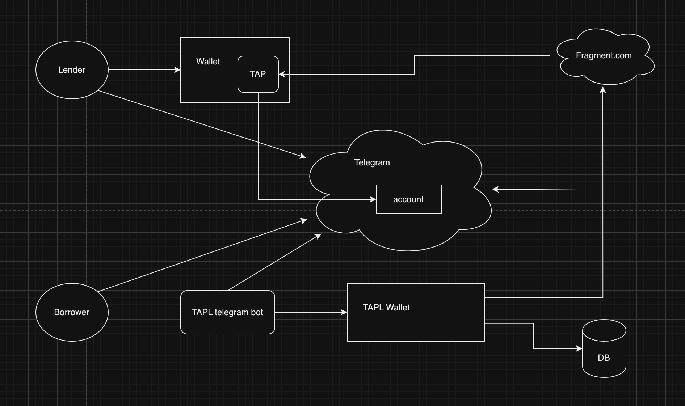

# TAPL

**TAPL**: **T**elegram **A**nonymous **P**hone-number **L**ending platform

Find us on Telegram: [@tap_lending_bot](https://t.me/tap_lending_bot)

...in case you just want to jump into codes:
- [TON-NFT-Lending](https://github.com/RainBoltz/TAPL/tree/main/ton-nft-lending): a framework for NFT lending on TON blockchain. This contains most of the business logic of TAPL.
- [TAPL-Bot](https://github.com/RainBoltz/TAPL/tree/main/tapl-bot): the Telegram Bot for TAPL. This is the frontend interface of TAPL.

> Don't Trust, Verify!

## Introduction

TAPL is a platform that allows you to lend your [Telegram Anonymous Phone-number](https://telegram.org/blog/ultimate-privacy-topics-2-0) (or some called "Anonymous Telegram Phone-number") to other people easily. The platform is based on the [Telegram](https://telegram.org/) messaging app and is represented by a [Telegram Bot](https://core.telegram.org/bots).

> isn't this **CENTRALIZED** 😡🤮🤢? Well, no other choice before we develope the contracts 🥺

### Why do I need TAPL?

A TAP is a kind of [Non-Fungible Token](https://en.wikipedia.org/wiki/Non-fungible_token) (NFT) with special utilities: it's not only a token, it's a phone-number that you can use to register on Telegram.

#### the Lender's perspective...

> Imagine that you have one or a bunch of anonymous phone-numbers that you are not using it at all. TAPs are just NFTs, they don't get a job and make money themselves, and we don't get any interest or benefit by locking them in our wallet. So why not lend them to other people and make some money?

1. We own some TAPs, but we are not using every of them.
2. We don't get any interest or benefit by locking them in our wallet.
3. We can lend them to other people and make some money.
4. For safety, we don't have to actually send the TAP to the borrower, we can just lend them the right to use the TAP. (e.i. give the borrower permission to access to the TAP login code)

#### the Borrower's perspective...

> Imagine you are a Telegram user who temporarily wants to register a new Telegram account and stay anonymous. You can buy a TAP from the market, but it may be too expensive. Why not just borrow one from other people?

1. We need a Telegram Anonymous Phone-number to register on Telegram.
2. Currently TAP is somehow too expensive that we can't afford it.
3. It may be a cheaper choice if We can borrow TAPs from other people and use them to register on Telegram instead of buying them.

### How does it work?

#### steps to become a Lender

1. Get an lending instructions from [TAPL Bot](https://t.me/tap_lending_bot).
2. Lend the TAP out by following the instructions (using command `/lend`).
3. Wait for the TAP to be borrowed. Check the TAP status any time on TAPL Bot (using command `/mylendings`).
4. Get an takeback instruction from TAPL Bot (using command `/takeback`).
5. Withdraw the TAP by following the instructions (only when the TAP is not borrowed).

#### steps to become a Borrower

1. Get a borrowing instructions from [TAPL Bot](https://t.me/tap_lending_bot).
2. Borrow the TAP by following the instructions (using command `/borrow`).
3. You temporarily owns the TAP until the lending period expires. Check the TAP status any time (using command `/myaccount`). You can get the corresponding Login Code though TAPL Bot (using command `/getcode`). 
4. You can register on Telegram with the Login Code. Note that when the lending period expires, you can't get the Login Code anymore so you can't access to the Telegram account with the TAP anymore.

## Diagrams

### TAPL System Architecture Diagram

### User workflow diagram

When Lender hasn't lent the TAP out, the Borrower wouldn't have the corresponding Login Code access so the Borrower can't register or login on Telegram with the TAP.

> the figure below shows the Lender hasn't lend out the TAP so the TAP is still lying in one's wallet

When Lender has lent the TAP out and is borrowed by the Borrower, the Borrower would have the corresponding Login Code access so the Borrower can register on Telegram with the TAP.

> the figure below shows the Lender has lent the TAP out and is borrowed by the Borrower, but the Borrower doesn't have the ownership of the TAP but only the Login Code access

When the lending period expires, the Borrower would lose the Login Code access so the Borrower can't register on Telegram with the TAP anymore.
